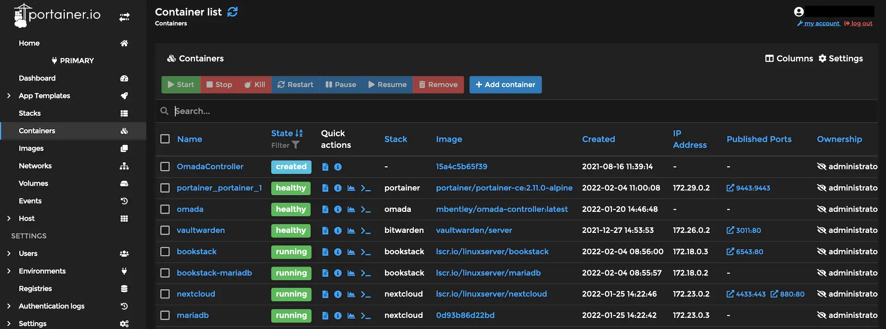

# Docker

**Docker** lets you put your **app** and everything it **needs** *(like libraries and settings)* into a small **package** called a **container**. This makes it easy to **run** your **app** on any **computer** without worrying about things breaking.

This uses **technology** called **containerizing**, basically only running the **software** of an *OS*.

While [Virtual Machines](../hosting/vm.md) *(VM)* needs **hardware** to be configured and then installs the **software** *(OS)*.

## Commands

*See https://docs.docker.com/reference/cli/docker/*

[Docker Commands Cheatsheet PDF](../images/docker_cheatsheet.pdf)

*Also link: https://docs.docker.com/get-started/docker_cheatsheet.pdf*

*See: https://www.geeksforgeeks.org/docker-instruction-commands/*

## Docker Compose

This is a tool created by the same developers who created **Docker**. The purpose of this tool is to easily run **multiple applications**, which may depend on each other. By making a simple **YAML** file and running it with `docker-compose` tool.

*See: https://docs.docker.com/compose/*

## Docker Desktop

This is the **Docker** version with **GUI**.

*See: https://docs.docker.com/desktop/*

## Portainer

This is a *docker container manager panel* with **UI** hosted inside a *docker container ***(web server)****.

*See https://www.portainer.io/*

