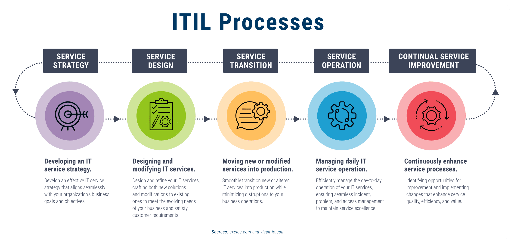

# ITIL Life Cycle (Information Technology Infrastructure Library)

Best practices to follow to help the organization meet its goals.

- ITSM - IT Service Management

# Processes

## Service Strategy

Make a strategy which will help you achieve your goals.

## Service Design

Design and develop solutions for the business.

## Service Transition

Transmit or move your solutions to production.

## Service Operation

Preform operations to keep and maintain the service running without any problems.

## Continual Service Improvement

Always improve and maintain good services.