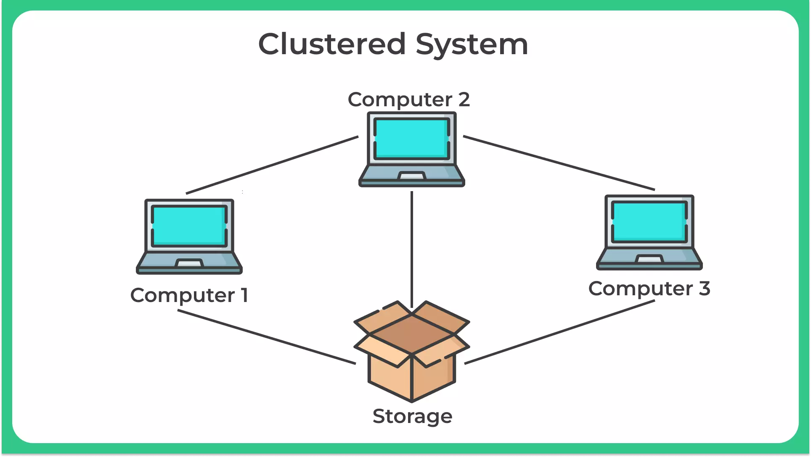

# Cluster

This is a **group** of **software** or **machines** running all together to complete **one job**. They serve the same **service** for all the clients. They are all together controlled by a **master**. This can be called "**Master Node**".

