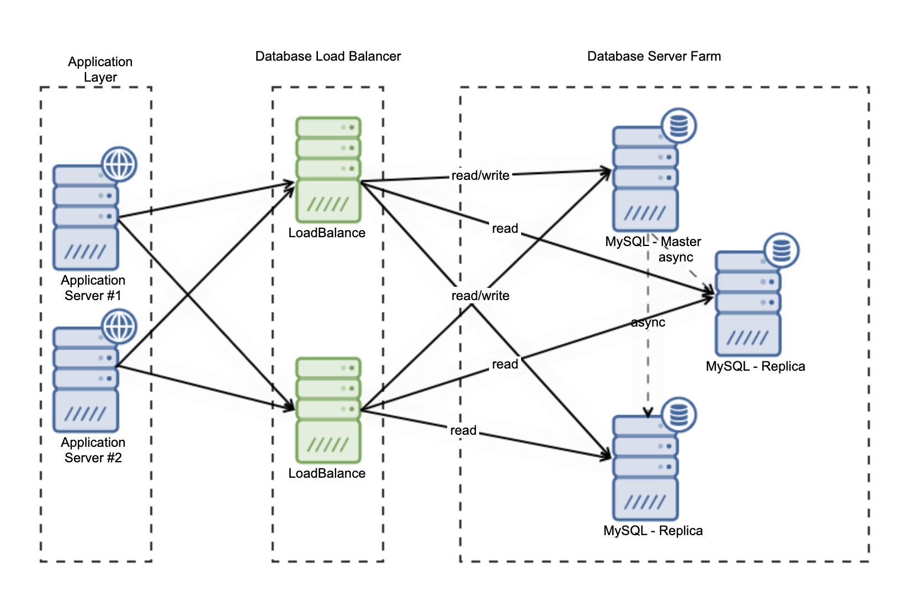

# Load Balancer

It takes the **big load** of traffic and **breaks** it down to **little traffic** and sends each **little traffic** to each **server** to handle.

## Structure

## Algorithms

- Round Robin - Goes in a **loop** one after another. Doesn't care how **loaded** each server is. It is just looping through **all** of them.

- Weighted Round Robin - It is like **Round Robin**, but it has **weights**. Each server has it's own **weight** and the bigger the **weight** is, the more requests will it get. Basically saying that this **server** has more **processing power**, then the other.

Example:

Server 1 - weight 1: every 3 requests it gets 1. 

Server 2 - weight 2: every 3 requests it gets 2.

- Lease connections - It **counts** how many **requests** each **server** has received and it sends the **next request** to the **server**, which has the **least amount** of sent **requests**. Basically **connections** = **requests**.

Example:

Server 1 - received 1 connection: This server is chosen.

Server 2 - received 2 connection: This server is not chosen.

- Lease response time - Like **lease connections**, but with **response time**. The **server** which responds the **fastest** will be chosen, which the load balancer will send the **next request**.

Example:

Server 1 - last request respond time 1 mils: This server is chosen.

Server 2 - last request respond time 2 mils: This server is not chosen.

- Lease bandwidth - Like **lease connections**, but here we **count** the amount of return **data** from the last **request**. The **server**, which doesn't use a lot of **bandwidth** and it doesn't **transmit** a lot of *data* over the **internet** will be chosen.

Example:

Server 1 - bandwidth usage 10 **kB** from the last request: This server is chosen.

Server 2 - bandwidth usage 20 **MB** from the last request: This server is not chosen.

- Hashing - Basically each **server** is bound to a **domain** or **endpoint**.

Example:

Server 1 - gets only request form **example.com**

Server 2 - gets only request form **example.com/v2**

## Other usages

- You can use it to **track** each **request** for each **server** for **analytics**.

- You can easily **configure** it and **reload** it without the need to **restart** or **redeploy** *(depending on the software load balancer).*

- Easy manage **multiple** servers at once.

