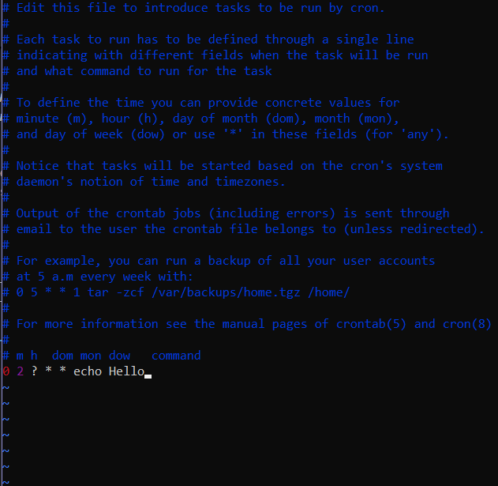

# CRON

**Super nice and helpful tool: https://crontab.guru/**

You **schedule** tasks to run at specific points in time.

You cannot use **seconds** and **years** in standard Linux **cron** *(via crontab)*, but you can use schedulers like **Quartz**.

## Characters:

- `*` *(Asterisk):* Represents **all** possible values for a field.

- `?` *(Question Mark):* Used in the ***day-of-month (DOM)*** and ***day-of-week (DOW)*** fields to **ignore** their time. You can **NOT** use `?` in both **DOM** and DOW at the **same** time. If you specify a value for **DOM**, then **DOW** must be `?`. If you specify a value for **DOW**, then **DOM** must be `?`.

- `-` *(Hyphen):* Specifies a **range** of values. Example: `5-10` in `0 5-7 * ? * * *`. Runs at **5**, **6** or **7 minutes** during the **hour**. Why the `0`? Because the **schedule** reads from **left** to **right** and, like that, we say *"Starts at ***second 0*** at ***minutes*** from ***5*** to ***7***, every ***hour***"*.

- `,` *(Comma):* Separates **multiple** values. Example: `0 5,6,7 * ? * * *` this will do the **same** thing as the example above.

- `/` *(Slash):* Specifies **increments** by adding **num1 + num2**. Example: `0 5/1 * ? * * *`. This will run from the **fifth** minute to the **59th** in that hour. Like **6**, **6**, **7**, **8** to **59** *included*.

## Quartz scheduler (library) CRON

It follows this **pattern**:

```sql
<second> <minute> <hour> <day-of-month> <month> <day-of-week> <year>
```

*See https://www.quartz-scheduler.org/*

## Linux CRON

It follows this **pattern**:

```sql
<minute> <hour> <day-of-month> <month> <day-of-week> /path/to/script_or_command
```

### Install

**For Debian/Ubuntu:**
```bash
sudo apt update
sudo apt install cron
```

**For RHEL/CentOS/Fedora:**
```bash
sudo yum install cronie
# or
sudo dnf install cronie
```

**For Arch Linux:**
```bash
sudo pacman -S cronie
```

### Enable CRON Service

>*Note: On Red Hat-based systems, the service might be named `crond` instead of `cron`:*

**Using `Systemctl` for services**

*(Interacts with `systemd`)*

```bash
sudo systemctl enable cron
sudo systemctl start cron
```

**Using `service` for services**

```bash
sudo service start cron
```

### Usage

- **Open your crontab:**

    ```bash
    crontab -e [username (option)]
    ```

Install any text **editor** and execute `crontab -e`. This will open a text **file**.

In that text **file**, specify all the **cron** jobs you want to run.



This will run the command `echo Hello` at **second 0** on the **2nd hour** *(2 AM)*, every **day**, every **month**.

- **List current user's cron jobs:**

    ```bash
    crontab -l
    ```

- **Remove current user's cron jobs:**

    ```bash
    crontab -r
    ```

You can view the **logs** of the **cron** job in the `/var/log/...` folder.

## Windows Server

*See https://learn.microsoft.com/en-us/windows-server/administration/windows-commands/schtasks*

## Windows 10/11

**Start** -> **Control Panel** -> **System and Security** -> **Administrative Tools** -> **Task Scheduler**

## Python

*See https://pypi.org/project/python-crontab/*

